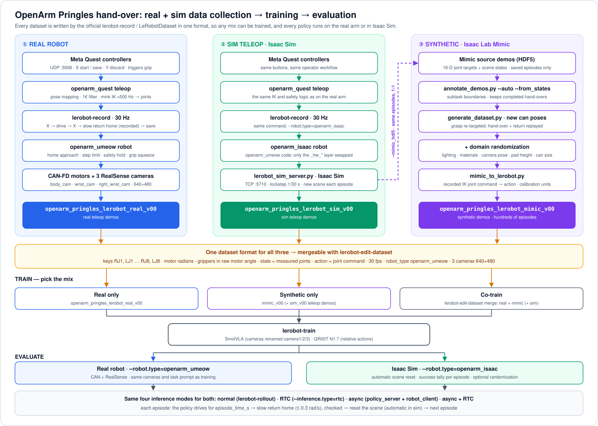

# This is the LeRobot-compatible VLA Training Pipeline



Three ways to collect data, one dataset format, then train on any mix and evaluate on the real arm or in Isaac
Sim: ① the real robot (Steps 0-5 below), ② the same teleop pipeline in Isaac Sim and ③ Isaac Lab Mimic synthetic
data from those sim demos ([Isaac Sim through the same pipeline](#isaac-sim-through-the-same-pipeline---robottypeopenarm_isaac)).

## Official LeRobot pipeline (Meta Quest)

```
Quest app (UDP :5006) -> openarm_quest teleop (mink IK) -> lerobot-record (30 Hz) -> openarm_umeow robot -> CAN
```

Two lerobot plugins in [`plugins/`](plugins/README.md) make this work:

| CLI flag | what it is |
|---|---|
| `--robot.type=openarm_umeow` | Our follower (`robots/umeow_openarm_follower`: gravity feed-forward, CAN fixes) with a safe start/stop, a jump guard and the gripper squeeze. Uses `calibration.json`; never re-zeroes the motors. |
| `--teleop.type=openarm_quest` | The Quest controllers -> the dora pipeline's pose mapping, smoothing and IK -> joint targets for the robot, with the reference captured on X, a slow return home and safety pauses. |

> ⚠️ Do **not** use the official `--robot.type=openarm_follower` / `lerobot-calibrate` on this robot: its
> calibration writes a new zero into the motors and breaks `calibration.json`.

### Step 0. One-time setup

```bash
cd ~/Stanley_ws/lerobot_openarm
git checkout official-lerobot-quest
uv sync                      # installs lerobot, both plugins and the IK libraries
hf auth login                # only if you push datasets / models to the Hub
```

The IK model is read from the dora checkout next to this one
(`~/Stanley_ws/dora-openarm-data-collection/.../scenes/v1_camera/scene.xml`), so keep that repo there.

### Step 1. Every session: prepare the terminal

```bash
# 1. CAN-FD links up (once per boot)
cd ~/Stanley_ws/openarm_can/setup && sudo ./my_arm

# 2. A terminal for lerobot, with ROS 2 kept out of it
cd ~/Stanley_ws/lerobot_openarm
source .venv/bin/activate
unset PYTHONPATH
export LD_LIBRARY_PATH=/usr/local/cuda/lib64
```

### Step 2. Teleoperate the real arm (no recording)

Drive the real OpenArm with the Quest through the official `lerobot-teleoperate`. Use it to practise the
task and to check tracking before you record.

```bash
lerobot-teleoperate \
  --robot.type=openarm_umeow \
  --robot.right_port=can0 --robot.left_port=can1 \
  --teleop.type=openarm_quest \
  --fps=30
```

What happens:

1. The terminal shows each joint's current vs. home position. **Type `YES`**, and both arms move slowly
   (0.3 rad/s) to the home pose with the grippers open.
2. The arms hold home (`HELD`) until you press **X** in the headset. See [Quest controls](#quest-controls-and-safety).
3. **Ctrl-C** stops: the arms ramp back to where they started, then the motors are disabled.

Notes:

- `--fps=30` matches recording. The default of 60 is more than the follower's CAN reads keep up with.
- To see the cameras while teleoperating, add the `--robot.cameras=...` from Step 3 plus `--display_data=true`.
- Every 5 s the terminal prints an `[openarm_umeow]` status line; its `bound X%` should stay near 0%.
- Keep a hand near the power / e-stop for the first run.

### Step 3. Record a dataset

```bash
cd ~/Stanley_ws/lerobot_openarm && source .venv/bin/activate
unset PYTHONPATH; export LD_LIBRARY_PATH=/usr/local/cuda/lib64

lerobot-record \
  --robot.type=openarm_umeow --robot.right_port=can0 --robot.left_port=can1 \
  --robot.cameras="{body_cam: {type: opencv, index_or_path: /dev/rs_body, width: 640, height: 480, fps: 30}, wrist_cam: {type: opencv, index_or_path: /dev/rs_wrist_left, width: 640, height: 480, fps: 30}, right_wrist_cam: {type: opencv, index_or_path: /dev/rs_wrist_right, width: 640, height: 480, fps: 30}}" \
  --teleop.type=openarm_quest \
  --dataset.repo_id=ethanCSL/openarm_pringles_lerobot_real_v00 --dataset.no_stamp=true \
  --dataset.single_task="Pick up the Pringles can with the right arm, hand it to the left arm" \
  --dataset.num_episodes=50 --dataset.fps=30 \
  --dataset.episode_time_s=120 --dataset.reset_time_s=15 \
  --dataset.streaming_encoding=true --dataset.encoder_threads=2 \
  --display_data=true
```

Useful flags:

- Continuing a dataset is automatic: run the same command again (same `--dataset.repo_id`, with
  `--dataset.no_stamp=true`). If `~/.cache/huggingface/lerobot/<repo_id>` already has episodes, the plugin adds
  `--resume=true --dataset.root=...` itself and prints how many there are. `--dataset.num_episodes` then counts the
  episodes to ADD, not the total. `--resume=false` turns this off.
- `--dataset.push_to_hub=false`: keep the dataset local only. It is saved under
  `~/.cache/huggingface/lerobot/<repo_id>` either way.

### Quest controls and safety

| Quest | state | what happens |
|---|---|---|
| **1st X** | `HELD` | **Start driving** (`LIVE`). Your current hand poses *and* the headset's pose are captured at this press; the arms follow your hands *relative to that moment* only. |
| **2nd X** | `LIVE` | **Return home slowly** (`RETURNING`, every joint <= 0.3 rad/s), still recording, then **save** the episode on arrival. The grippers open after the save. |
| **X** | `PAUSED` | **Return home slowly while still recording** (grippers kept, so a held object stays held); the arms then wait at home with the episode open. |
| **X** | `HELD` (episode open) | **Continue** the same episode from home (hands re-anchored, no jump). |
| **Y** | `LIVE` / `PAUSED` / `HELD` (episode open) | **Discard** the episode at once and **return home slowly**; grippers open on arrival. |
| **Triggers** | `LIVE` | close the grippers. |
| **A** / **B** | any | no function. |

A controller position that jumps faster than 4 m/s or 900 deg/s is never followed. One such jump is a
tracking snap (the Quest re-finding a controller it lost sight of, e.g. held low or behind the can, since the
headset hangs at the neck): it is ignored, the arm holds still and follows on from there (terminal: "a tracking
snap -- IGNORED"). Keep the controllers in front of the headset to avoid them.

Every return home (2nd X, Y, the time limit, recovery) is verified on the MEASURED joints: it ends only
when each arm joint is within 0.1 rad of home (3 s to settle). If one is not, the terminal and rerun say
`NOT at the reset pose: RJ7.pos is +0.50 rad from home`, and X is refused until it is -- no episode starts
from a wrong pose. A motor that trips its protection (OVERCURRENT from twisting a wrist against its stop or
cable, OVERTEMP, ...) switches itself off and goes limp: `MOTOR FAULT` names it, the arm holds, and the
hold stays until the motor answers again (Ctrl+C and restart; saved episodes are safe). The 5 s stats line
also shows the observation read time, which grows when a motor stops answering.

`PAUSED` stops the arms where they are when something is too fast: repeated jumps (3 within 2 s), a joint
more than 1 rad behind its target (joint speed cap: 2 rad/s), or the IK jumping (e.g. an arm stretched out).
The terminal and the rerun panel say which joint or limit and why. If `episode_time_s` runs out meanwhile,
X recovers home and the episode is saved on arrival.

**Rerun window** (`--display_data=true`): top-left the **status** panel (episode, phase, Quest buttons and
tracking); top-right the **network** panel and a latency plot -- ping to the Quest (median of 3 per second,
plus Wi-Fi wake-up spikes), how late the Quest's packets arrive vs the best this session (the lag your
teleop actually feels), and this PC's Wi-Fi (SSID, band, signal, link speed). A line climbing in the plot
means latency is building up; ✅ < 50 ms, ⚠️ < 150 ms, ❌ above.

Check the recorded data:

```bash
lerobot-dataset-viz --repo-id ethanCSL/openarm_pringles_lerobot_real_v00 --episode-index 0
```

### Step 4. Train (official command)

```bash
lerobot-train \
  --policy.path=lerobot/smolvla_base \
  --dataset.repo_id=ethanCSL/openarm_pringles_lerobot_real_v00 \
  --rename_map='{"observation.images.right_wrist_cam": "observation.images.camera1", "observation.images.wrist_cam": "observation.images.camera2", "observation.images.body_cam": "observation.images.camera3"}' \
  --policy.repo_id=ethanCSL/smolvla_pringles_lerobot_real_v00 \
  --batch_size=64 --steps=20000 --policy.device=cuda \
  --output_dir=outputs/train/smolvla_pringles_lerobot_real_v00 \
  --job_name=smolvla_pringles_lerobot_real_v00 \
  --wandb.enable=true
```

- `--rename_map` is required: `smolvla_base` names its three cameras `camera1/2/3`, our datasets name them
  `right_wrist_cam / wrist_cam / body_cam`. This is the same mapping your earlier SmolVLA checkpoints used.
- `--policy.repo_id` is where the model is uploaded; to keep it local, use `--policy.push_to_hub=false` instead.
- Train on datasets recorded with **this** pipeline. Checkpoints trained on the Isaac-mirror datasets are not
  interchangeable: those store sim-unit joints (grippers 0-0.044) in a different key order.

**GR00T N1.7**, the same recipe as the earlier `openarm_pringles_gr00t_real_v00` checkpoint (does **not**
fit the 16 GB GPU here, even at batch 1 -- train on a larger GPU):

```bash
lerobot-train --policy.type=groot --policy.base_model_path=nvidia/GR00T-N1.7-3B \
  --policy.chunk_size=16 --policy.n_action_steps=16 \
  --policy.use_relative_actions=true --policy.relative_exclude_joints='["LJ8", "RJ8"]' \
  --dataset.repo_id=ethanCSL/openarm_pringles_lerobot_real_v00 \
  --policy.repo_id=ethanCSL/groot_pringles_lerobot_real_v00 \
  --batch_size=64 --steps=20000 --policy.device=cuda \
  --output_dir=outputs/train/groot_pringles_lerobot_real_v00 --job_name=groot_pringles_lerobot_real_v00
```

### Step 5. Evaluate on the real robot: normal, async, RTC

Four ways to run a trained policy, for both SmolVLA and GR00T N1.7: normal, async and RTC are official lerobot
tools; async + RTC is the combination the RTC docs recommend ("use both together"), which lerobot's policy
server does not implement, so our server wrapper adds it. Prepare the terminal as in Step 1 (the Quest is not
needed).

| mode | what it does | tool |
|---|---|---|
| **normal** | predict a chunk, execute it, predict the next; the robot waits during each inference | `lerobot-rollout` |
| **async** ([docs](https://huggingface.co/docs/lerobot/main/en/async)) | a policy server computes the next chunk while the robot client is still executing the current one, and overlapping chunks are aggregated; no waiting, inference can run on another machine | `policy_server` + `robot_client` |
| **RTC** ([docs](https://huggingface.co/docs/lerobot/main/en/rtc)) | inference in a background thread, and each new chunk is *guided* to continue smoothly from the actions already being executed | `lerobot-rollout --inference.type=rtc` |
| **async + RTC** | async's server/client split, with every chunk RTC-guided to continue the client's unexecuted actions | `policy_server --rtc=true` + `robot_client` |

The commands use the two checkpoints trained on `openarm_pringles_lerobot_real_v00`: SmolVLA
`ethanCSL/openarm_pringles_lerobot_real_v00_0` and GR00T N1.7 `ethanCSL/openarm_pringles_lerobot_real_gr00t_v00`.
For a checkpoint you trained in Step 4, pass its `--policy.repo_id`, or the local
`outputs/train/<job>/checkpoints/last/pretrained_model` folder, instead.

Every command below runs a series of **evaluation episodes**: the policy drives for `episode_time_s`, the arm
returns **slowly** (<= 0.3 rad/s) to the start pose and is checked there, then `reset_time_s` gives you time
to reset the scene, and the next episode starts -- `num_episodes` times. The three numbers are set by:

| | normal, RTC (`lerobot-rollout`) | async, async + RTC (`robot_client`) |
|---|---|---|
| number of episodes | `--dataset.num_episodes=10` | `--num_episodes=10` |
| episode time (s) | `--dataset.episode_time_s=60` | `--episode_time_s=60` |
| reset time (s) | `--dataset.reset_time_s=60` | `--reset_time_s=60` |

Same keys in every mode: during an episode **Right arrow** (or `n`) ends it, **Left arrow** (`r`) runs it
again (not counted), **Esc** (`q`) stops; during a reset **Right arrow** ends it early. After the last
episode (or Esc) the arm returns to the start pose, then disconnects.

#### Normal

`lerobot-rollout --strategy.type=episodic` also records each episode as a dataset, to watch or score later.
The name must start with `rollout_`; lerobot appends the date and time to it (`..._v00_20261010_153000`), so
the same command can be run again for the next evaluation.

```bash
# SmolVLA
lerobot-rollout --strategy.type=episodic \
  --policy.path=ethanCSL/openarm_pringles_lerobot_real_v00_0 \
  --robot.type=openarm_umeow --robot.right_port=can0 --robot.left_port=can1 \
  --robot.cameras="{body_cam: {type: opencv, index_or_path: /dev/rs_body, width: 640, height: 480, fps: 30}, wrist_cam: {type: opencv, index_or_path: /dev/rs_wrist_left, width: 640, height: 480, fps: 30}, right_wrist_cam: {type: opencv, index_or_path: /dev/rs_wrist_right, width: 640, height: 480, fps: 30}}" \
  --rename_map='{"observation.images.right_wrist_cam": "observation.images.camera1", "observation.images.wrist_cam": "observation.images.camera2", "observation.images.body_cam": "observation.images.camera3"}' \
  --task="Pick up the Pringles can with the right arm, hand it to the left arm" \
  --dataset.repo_id=ethanCSL/rollout_smolvla_pringles_v00 --dataset.push_to_hub=false \
  --dataset.single_task="Pick up the Pringles can with the right arm, hand it to the left arm" \
  --dataset.num_episodes=10 --dataset.episode_time_s=60 --dataset.reset_time_s=60 \
  --display_data=true

# GR00T N1.7 (no --rename_map: GR00T keeps the dataset's camera names)
lerobot-rollout --strategy.type=episodic \
  --policy.path=ethanCSL/openarm_pringles_lerobot_real_gr00t_v00 \
  --robot.type=openarm_umeow --robot.right_port=can0 --robot.left_port=can1 \
  --robot.cameras="{body_cam: {type: opencv, index_or_path: /dev/rs_body, width: 640, height: 480, fps: 30}, wrist_cam: {type: opencv, index_or_path: /dev/rs_wrist_left, width: 640, height: 480, fps: 30}, right_wrist_cam: {type: opencv, index_or_path: /dev/rs_wrist_right, width: 640, height: 480, fps: 30}}" \
  --task="Pick up the Pringles can with the right arm, hand it to the left arm" \
  --dataset.repo_id=ethanCSL/rollout_groot_pringles_v00 --dataset.push_to_hub=false \
  --dataset.single_task="Pick up the Pringles can with the right arm, hand it to the left arm" \
  --dataset.num_episodes=10 --dataset.episode_time_s=60 --dataset.reset_time_s=60 \
  --display_data=true
```

For one open-ended run instead: `--strategy.type=base --duration=60` and no `--dataset.*` flags.

#### Async (policy server + robot client)

Terminal 1, the policy server (same machine: `127.0.0.1`; another GPU machine: its IP, and `--host=0.0.0.0`).
It stays up across episodes, and across evaluations:

```bash
cd ~/Stanley_ws/lerobot_openarm
source .venv/bin/activate
unset PYTHONPATH
export LD_LIBRARY_PATH=/usr/local/cuda/lib64
python -m lerobot_robot_openarm_umeow.policy_server --host=127.0.0.1 --port=8080
```

Terminal 2, the robot client:

```bash
cd ~/Stanley_ws/lerobot_openarm
source .venv/bin/activate
unset PYTHONPATH
export LD_LIBRARY_PATH=/usr/local/cuda/lib64

# SmolVLA
python -m lerobot_robot_openarm_umeow.robot_client \
  --server_address=127.0.0.1:8080 \
  --robot.type=openarm_umeow --robot.right_port=can0 --robot.left_port=can1 \
  --robot.cameras="{body_cam: {type: opencv, index_or_path: /dev/rs_body, width: 640, height: 480, fps: 30}, wrist_cam: {type: opencv, index_or_path: /dev/rs_wrist_left, width: 640, height: 480, fps: 30}, right_wrist_cam: {type: opencv, index_or_path: /dev/rs_wrist_right, width: 640, height: 480, fps: 30}}" \
  --task="Pick up the Pringles can with the right arm, hand it to the left arm" \
  --policy_type=smolvla --pretrained_name_or_path=ethanCSL/openarm_pringles_lerobot_real_v00_0 \
  --policy_device=cuda --actions_per_chunk=50 --chunk_size_threshold=0.5 \
  --aggregate_fn_name=weighted_average --fps=30 \
  --num_episodes=10 --episode_time_s=60 --reset_time_s=60

# GR00T N1.7
python -m lerobot_robot_openarm_umeow.robot_client \
  --server_address=127.0.0.1:8080 \
  --robot.type=openarm_umeow --robot.right_port=can0 --robot.left_port=can1 \
  --robot.cameras="{body_cam: {type: opencv, index_or_path: /dev/rs_body, width: 640, height: 480, fps: 30}, wrist_cam: {type: opencv, index_or_path: /dev/rs_wrist_left, width: 640, height: 480, fps: 30}, right_wrist_cam: {type: opencv, index_or_path: /dev/rs_wrist_right, width: 640, height: 480, fps: 30}}" \
  --task="Pick up the Pringles can with the right arm, hand it to the left arm" \
  --policy_type=groot --pretrained_name_or_path=ethanCSL/openarm_pringles_lerobot_real_gr00t_v00 \
  --policy_device=cuda --actions_per_chunk=16 --chunk_size_threshold=0.5 \
  --aggregate_fn_name=weighted_average --fps=30 \
  --num_episodes=10 --episode_time_s=60 --reset_time_s=60
```

- Use **`lerobot_robot_openarm_umeow.policy_server`**, not `lerobot.async_inference.policy_server`: it is
  lerobot's server with the fixes our checkpoints need -- it keeps the checkpoint's camera rename map
  (lerobot's client cannot send one, and the server would otherwise drop it), decodes GR00T's relative
  actions a whole chunk at a time (lerobot's server does one step at a time, which GR00T rejects), and
  loads GR00T in bf16 (`--policy_dtype=auto|bf16|fp32`). Same flags otherwise.
- It also fixes lerobot's "too similar observation" filter for this robot: the server skips an observation
  whose joint vector is within 1.0 of the last one it ran, meant as ~1 degree for lerobot's degree-based arms;
  ours report radians (1.0 = ~57 degrees), so lerobot's server only predicted once the client's queue had
  emptied -- async collapsed to synchronous. Now `--obs_similarity_atol=0.0175` (1 degree in radians).
- And it passes the camera images at their own resolution. lerobot's server resizes them to the policy's
  image feature shape, which for a SmolVLA fine-tuned from smolvla_base is the base model's 256x256: our
  640x480 frames were squashed (aspect ratio lost), unlike in training and in `lerobot-rollout`, where the
  policy gets the full frame and letterboxes it itself. On a real checkpoint that changed actions by up to 0.04 rad.
- **`lerobot_robot_openarm_umeow.robot_client`** is lerobot's robot client (same flags, same action queue and
  aggregation) run as episodes; lerobot's own has none. The policy is loaded once. Each episode starts clean:
  the client's action queue is emptied and the server is told a new client is ready, so it forgets the
  previous episode's observations and (with `--rtc=true`) its last chunk. It prints each episode's length and
  actions executed, and a summary at the end; nothing is recorded. Without `--num_episodes` it is lerobot's
  client unchanged (one open-ended run, Ctrl-C stops).
- An `Error in observation sender: Client not running` line when an episode ends is lerobot's client noticing
  that the episode clock stopped it between two observations: harmless.
- `--actions_per_chunk` <= the policy's chunk size (SmolVLA 50, our GR00T 16); `--chunk_size_threshold`
  0.5-0.6 is the docs' recommendation; add `--debug_visualize_queue_size=true` to plot the action queue when
  tuning.

#### RTC (Real-Time Chunking)

```bash
# SmolVLA
lerobot-rollout --strategy.type=episodic \
  --inference.type=rtc --inference.rtc.mode=guided \
  --inference.rtc.execution_horizon=10 --inference.rtc.max_guidance_weight=10.0 \
  --policy.path=ethanCSL/openarm_pringles_lerobot_real_v00_0 \
  --robot.type=openarm_umeow --robot.right_port=can0 --robot.left_port=can1 \
  --robot.cameras="{body_cam: {type: opencv, index_or_path: /dev/rs_body, width: 640, height: 480, fps: 30}, wrist_cam: {type: opencv, index_or_path: /dev/rs_wrist_left, width: 640, height: 480, fps: 30}, right_wrist_cam: {type: opencv, index_or_path: /dev/rs_wrist_right, width: 640, height: 480, fps: 30}}" \
  --rename_map='{"observation.images.right_wrist_cam": "observation.images.camera1", "observation.images.wrist_cam": "observation.images.camera2", "observation.images.body_cam": "observation.images.camera3"}' \
  --task="Pick up the Pringles can with the right arm, hand it to the left arm" \
  --dataset.repo_id=ethanCSL/rollout_smolvla_rtc_pringles_v00 --dataset.push_to_hub=false \
  --dataset.single_task="Pick up the Pringles can with the right arm, hand it to the left arm" \
  --dataset.num_episodes=10 --dataset.episode_time_s=60 --dataset.reset_time_s=60 \
  --display_data=true

# GR00T N1.7 (execution_horizon 8, no --rename_map)
lerobot-rollout --strategy.type=episodic \
  --inference.type=rtc --inference.rtc.mode=guided \
  --inference.rtc.execution_horizon=8 --inference.rtc.max_guidance_weight=10.0 \
  --policy.path=ethanCSL/openarm_pringles_lerobot_real_gr00t_v00 \
  --robot.type=openarm_umeow --robot.right_port=can0 --robot.left_port=can1 \
  --robot.cameras="{body_cam: {type: opencv, index_or_path: /dev/rs_body, width: 640, height: 480, fps: 30}, wrist_cam: {type: opencv, index_or_path: /dev/rs_wrist_left, width: 640, height: 480, fps: 30}, right_wrist_cam: {type: opencv, index_or_path: /dev/rs_wrist_right, width: 640, height: 480, fps: 30}}" \
  --task="Pick up the Pringles can with the right arm, hand it to the left arm" \
  --dataset.repo_id=ethanCSL/rollout_groot_rtc_pringles_v00 --dataset.push_to_hub=false \
  --dataset.single_task="Pick up the Pringles can with the right arm, hand it to the left arm" \
  --dataset.num_episodes=10 --dataset.episode_time_s=60 --dataset.reset_time_s=60 \
  --display_data=true
```

- `execution_horizon`: actions of the previous chunk the new one is guided to match; 8-12, and below the
  chunk size. `max_guidance_weight` 10.0 is the docs' value for 10-step flow matching.

#### Async + RTC

The async setup above, with RTC done by the server: for each new observation, the server takes the actions
of its last chunk that the client has not executed yet (it knows their timesteps), re-anchors them to the new
state for relative-action policies (GR00T), and predicts the next chunk RTC-guided to continue them, with the
inference delay estimated from the measured latency -- the same lerobot helpers `lerobot-rollout`'s RTC uses.

Terminal 1:

```bash
# SmolVLA
python -m lerobot_robot_openarm_umeow.policy_server --host=127.0.0.1 --port=8080 \
  --rtc=true --rtc_execution_horizon=10 --rtc_max_guidance_weight=10.0 --rtc_prefix_attention_schedule=EXP

# GR00T N1.7
python -m lerobot_robot_openarm_umeow.policy_server --host=127.0.0.1 --port=8080 \
  --rtc=true --rtc_execution_horizon=8 --rtc_max_guidance_weight=10.0 --rtc_prefix_attention_schedule=EXP
```

Terminal 2, as for async but with `--aggregate_fn_name=latest_only` (RTC has already blended the overlap;
averaging it again would undo that):

```bash
# SmolVLA
python -m lerobot_robot_openarm_umeow.robot_client \
  --server_address=127.0.0.1:8080 \
  --robot.type=openarm_umeow --robot.right_port=can0 --robot.left_port=can1 \
  --robot.cameras="{body_cam: {type: opencv, index_or_path: /dev/rs_body, width: 640, height: 480, fps: 30}, wrist_cam: {type: opencv, index_or_path: /dev/rs_wrist_left, width: 640, height: 480, fps: 30}, right_wrist_cam: {type: opencv, index_or_path: /dev/rs_wrist_right, width: 640, height: 480, fps: 30}}" \
  --task="Pick up the Pringles can with the right arm, hand it to the left arm" \
  --policy_type=smolvla --pretrained_name_or_path=ethanCSL/openarm_pringles_lerobot_real_v00_0 \
  --policy_device=cuda --actions_per_chunk=50 --chunk_size_threshold=0.5 \
  --aggregate_fn_name=latest_only --fps=30 \
  --num_episodes=10 --episode_time_s=60 --reset_time_s=60

# GR00T N1.7
python -m lerobot_robot_openarm_umeow.robot_client \
  --server_address=127.0.0.1:8080 \
  --robot.type=openarm_umeow --robot.right_port=can0 --robot.left_port=can1 \
  --robot.cameras="{body_cam: {type: opencv, index_or_path: /dev/rs_body, width: 640, height: 480, fps: 30}, wrist_cam: {type: opencv, index_or_path: /dev/rs_wrist_left, width: 640, height: 480, fps: 30}, right_wrist_cam: {type: opencv, index_or_path: /dev/rs_wrist_right, width: 640, height: 480, fps: 30}}" \
  --task="Pick up the Pringles can with the right arm, hand it to the left arm" \
  --policy_type=groot --pretrained_name_or_path=ethanCSL/openarm_pringles_lerobot_real_gr00t_v00 \
  --policy_device=cuda --actions_per_chunk=16 --chunk_size_threshold=0.5 \
  --aggregate_fn_name=latest_only --fps=30 \
  --num_episodes=10 --episode_time_s=60 --reset_time_s=60
```

- The server log shows each chunk: `RTC chunk @ timestep N: guided by K unexecuted actions, inference_delay D`.
  `K` > 0 means RTC is active; `D` is the estimated latency in steps (measured on the RTX 5080: about 2 for
  GR00T, 4-5 for SmolVLA; it rises for a while after a slow inference). The first chunk of every episode is
  guided by 0: the previous episode's chunk is forgotten.
- RTC needs observations mid-chunk: keep `--chunk_size_threshold` around 0.5. Near 0 the client only asks
  when its queue is empty, and there is nothing left to continue.

#### Notes for all modes

- The arm goes to the home pose first (type `YES`; `--robot.assume_yes=true` skips it), grippers open. On exit
  it returns to that pose, then to where it was before connecting, then the motors are disabled.
- `--rename_map` is required for SmolVLA in `lerobot-rollout` (it checks the cameras before loading the policy).
- `--task` and `--robot.cameras` must match the recording **exactly** (same text, same camera names).
- GR00T uses relative actions: lerobot's normal mode decodes them one step at a time, which GR00T rejects,
  so the robot plugin decodes each chunk whole instead (same result, still synchronous). GR00T is also loaded
  in bf16 (`--robot.policy_dtype=auto`, the default): in fp32 it ran out of memory on the 16 GB GPU.
- The robot's safety guard applies to every mode: an action that jumps or strays from the measured joints
  triggers a `SAFETY HOLD` (the arm stops) instead of being executed.
- Checkpoints trained on the old Isaac-mirror datasets cannot drive this robot (different joint order and
  units): train on data recorded with Step 3 (real) or the Isaac Sim pipeline below.


## Isaac Sim through the same pipeline (`--robot.type=openarm_isaac`)

```
Quest -> openarm_quest (same IK) -> lerobot-record (30 Hz) -> openarm_isaac -> TCP :5710 -> lerobot_sim_server.py (Isaac Sim)
                                         |                                                        |  (--mimic_hdf5)
                              lerobot dataset (sim teleop)                             Mimic source demos (HDF5)
                                         |                                                        |
                                         |                       annotate_demos.py -> generate_dataset.py (+ domain randomization)
                                         |                                                        |
                                         |                                          mimic_to_lerobot.py (synthetic, same format)
                                         v                                                        v
                      train: real only | synthetic only | co-train (lerobot-edit-dataset merge)  -> evaluate: real or sim
```

| sim step | what | output |
|---|---|---|
| 1-3 | teleoperate in sim through `lerobot-record`, exactly like the real arm | `..._sim_v00` lerobot dataset + the same demos as Mimic source HDF5 |
| 4 | Isaac Lab Mimic multiplies the demos to new can poses, with domain randomization, then converts | `..._mimic_v00` lerobot dataset |
| 5 | pick the training mix: synthetic only, or merge with the real dataset | a trained policy |
| 6 | evaluate in sim (or on the real arm, Step 5) | success tally |

`openarm_isaac` is `openarm_umeow` with Isaac Sim in place of the CAN bus and the RealSense cameras: the start
pose, step limit, safety guard, slow returns, Quest controls, episode structure and dataset format are the same
code. A sim dataset therefore has the real one's keys and order (`RJ1, LJ1, ...`), units (motor radians,
grippers in raw motor angle via `calibration.json`), action meaning (the teleop's command, not the next
measured pose), 30 fps and episodes (start on X at home, the return home recorded). It also records
`robot_type=openarm_umeow`, so real and sim datasets can be merged and trained together (put `sim` in the
repo name to tell them apart).

What it does NOT close: the visual gap (the sim's table, background and lighting look nothing like the lab;
check the wrist cameras' mount poses against the real ones) and the physics gap. For those: domain
randomization (`--domain_randomization visual|full` on the server) and co-training with real episodes.

Differences from the real commands, everywhere below:

- `--robot.type=openarm_isaac` replaces `--robot.type=openarm_umeow --robot.right_port=can0 --robot.left_port=can1
  --robot.cameras=...`. The sim's cameras have the real names (`body_cam`, `wrist_cam`, `right_wrist_cam`, 640x480).
- No CAN step, no typed `YES`: on connect the sim arm is placed at the home pose, grippers open.
- The scene is re-randomized (the can moved, randomization re-drawn, the robot left where it is) each time a
  recording episode starts waiting for X, and after each evaluation episode's return home -- where a person
  would reset the table. So `reset_time_s` can be 1.
- After every episode the terminal prints whether it met the task's success condition and the running tally
  (`[openarm_isaac] episode 3: SUCCESS (task success condition) -- 2/3 so far.`). While recording it is
  informational: saving is still your X / Y.
- Lockstep: the simulator advances exactly one 1/30 s step per frame, so recorded timing is exact however fast
  the PC renders -- but the sim runs slower than real time, and motion looks slow while you teleoperate.
  Measured on the RTX 5080: `--headless` ~36 ms per step (~25 steps/s, ~0.85x real time); with the Isaac Sim
  window ~58 ms (~17 steps/s, ~0.55x). The server prints `steps/s` every 10 s, and lerobot warns "Control loop
  is running slower than the target FPS" -- expected here, no frames are lost. In async evaluation the sim
  also pauses whenever the client's action queue is empty, so inference latency costs no sim time there.

### Sim Step 1. Start the simulator (terminal 1, keep it running)

```bash
cd ~/Stanley_ws/IsaacLab
conda activate env_isaaclab
./isaaclab.sh -p scripts/tools/lerobot_sim_server.py --enable_cameras --headless \
  --task Isaac-PickUp-RedCube-OpenArm-IK-Abs-v0 --task_mode handover \
  --domain_randomization none \
  --mimic_hdf5 logs/demos/pringles_sim_src_v00.hdf5
```

Wait for `[lerobot_sim_server] ready on 127.0.0.1:5710` (~1 min). It serves one robot at a time and waits for
the next when one disconnects, so it stays up across recordings and evaluations; Ctrl-C stops it.

- `--mimic_hdf5`: every episode `lerobot-record` SAVES is also written to this Isaac Lab HDF5 as a Mimic source
  demo (absolute joint targets, scene states each step), and discarded ones are dropped -- the HDF5 and the
  lerobot dataset hold the same demos in the same order. An existing file is appended to. Leave it out for
  teleoperation and evaluation.
- Record the Mimic source demos with `--domain_randomization none`: randomization belongs to the generation
  step (Sim Step 4), and annotation replays the demos in an unrandomized env.
- `--headless` keeps the sim near real time (the window costs ~40% of the speed, see above); watch the three
  cameras in rerun (`--display_data=true`). Drop `--headless` to see the Isaac Sim window.
- Other options: `--task_mode left|right|handover`, `--port` (then `--robot.port=...` on the lerobot side),
  `--domain_randomization visual|full` (+ `--enable_camera_shake`) for randomized evaluation or for a
  randomized teleop dataset.

The lerobot commands below run in a second terminal, prepared as in Step 1 without the CAN step:

```bash
cd ~/Stanley_ws/lerobot_openarm
source .venv/bin/activate
unset PYTHONPATH
export LD_LIBRARY_PATH=/usr/local/cuda/lib64
```

### Sim Step 2. Teleoperate in sim (no recording)

```bash
lerobot-teleoperate \
  --robot.type=openarm_isaac \
  --teleop.type=openarm_quest \
  --fps=30 --display_data=true
```

Same Quest controls as on the real arm ([Quest controls](#quest-controls-and-safety)). Ctrl-C stops.

### Sim Step 3. Record sim demos (lerobot dataset + Mimic source demos)

```bash
lerobot-record \
  --robot.type=openarm_isaac \
  --teleop.type=openarm_quest \
  --dataset.repo_id=ethanCSL/openarm_pringles_lerobot_sim_v00 --dataset.no_stamp=true \
  --dataset.single_task="Pick up the Pringles can with the right arm, hand it to the left arm" \
  --dataset.num_episodes=20 --dataset.fps=30 \
  --dataset.episode_time_s=120 --dataset.reset_time_s=1 \
  --dataset.streaming_encoding=true --dataset.encoder_threads=2 \
  --display_data=true
```

One session gives two outputs: the lerobot dataset `ethanCSL/openarm_pringles_lerobot_sim_v00` (trainable
as is) and, with the server's `--mimic_hdf5`, the same episodes in `logs/demos/pringles_sim_src_v00.hdf5`
for Mimic (the terminal says `also saved as Mimic source demo demo_N`).

- Use the same `--dataset.single_task` text as the real dataset: it is the prompt the policy is trained and
  evaluated with. Continuing, `--dataset.push_to_hub=false` and the viewer work as in Step 3.
- For Mimic, each demo must END with the hand-over done and the can still in the LEFT hand: Mimic only keeps
  generated episodes whose last frame shows that. Do the hand-over, then press X: the arms return home still
  holding what they hold (recorded), and the grippers open only after the save -- which is what makes it work.
- Mimic transforms only the right arm's reach-and-grasp to each new can pose; everything after the grasp,
  including the left arm and the return home, is replayed as recorded. Hold the can still at the pass point for
  ~0.5 s before the left hand closes: the two arms then have slack to stay in step in generated episodes.
- ~10-20 good demos covering the can's spawn area are enough for Mimic.

### Sim Step 4. Generate a synthetic dataset with Isaac Lab Mimic (domain randomization here)

Terminal 1 (stop the server first, Ctrl-C: one Isaac Sim at a time fits the 16 GB GPU):

```bash
cd ~/Stanley_ws/IsaacLab && conda activate env_isaaclab

# 4a. Annotate the subtask boundaries (replays each demo from its recorded states)
./isaaclab.sh -p scripts/imitation_learning/isaaclab_mimic/annotate_demos.py \
  --task Isaac-PickUp-RedCube-OpenArm-IK-Abs-Mimic-v0 \
  --task_mode handover --auto --from_states \
  --enable_cameras --headless \
  --input_file logs/demos/pringles_sim_src_v00.hdf5 \
  --output_file logs/demos/pringles_sim_src_v00_annotated.hdf5

# 4b. Generate: new can poses, with domain randomization
./isaaclab.sh -p scripts/imitation_learning/isaaclab_mimic/generate_dataset.py \
  --task Isaac-PickUp-RedCube-OpenArm-IK-Abs-Mimic-v0 --task_mode handover \
  --input_file logs/demos/pringles_sim_src_v00_annotated.hdf5 \
  --output_file logs/demos/pringles_sim_mimic_v00.hdf5 \
  --generation_num_trials 500 --num_envs 4 --enable_cameras --headless \
  --enable_domain_randomization --domain_randomization_profile visual
```

- Annotate exports only the demos whose hand-over completes (`Exported N (out of M) annotated episodes`).
- Generation keeps only successful trials, and for OpenArm `--generation_num_trials` counts SUCCESSES (the
  Mimic cfg sets `generation_guarantee`): it keeps trying until it has that many. It prints the success rate.
  Randomization: `--domain_randomization_profile visual` (lighting, materials, camera pose) or `full`, plus
  `--enable_camera_shake` and `--randomize_object_size`. Keep `--num_envs` <= 4 (8 envs x 3 cameras ran out of
  GPU memory); 500 episodes take ~70 GB of disk.
- Both scripts refuse demos recorded at another control rate; the server and generation both run at 30 Hz.
- For OpenArm tasks, generation also records the joint targets the IK commands each step
  (`lerobot/joint_pos_target`, see IsaacLab `openarm_recorders.py`): that is what the converter below stores as
  `action`, the same quantity as the teleop's command in the real datasets.

Back in the lerobot terminal, convert it to the real datasets' format:

```bash
python mimic_to_lerobot.py \
  --hdf5 ~/Stanley_ws/IsaacLab/logs/demos/pringles_sim_mimic_v00.hdf5 \
  --repo_id ethanCSL/openarm_pringles_lerobot_mimic_v00 --push_to_hub
```

Per step: `observation.state` = the measured joints before the step, `observation.images.*` = the frames
rendered before it, `action` = the joint targets of the step, all mapped to motor radians through
`calibration.json`. Same keys, order, units, `robot_type`, 30 fps and video encoding as `lerobot-record`, so it
merges with the real and the teleop-sim datasets. It refuses an HDF5 generated at another rate, and
`--task` defaults to the real datasets' task string.

### Sim Step 5. Train: synthetic only, or co-train sim + real

All three datasets have the same format, so the choice is only which dataset `lerobot-train` gets:

| model | dataset |
|---|---|
| real only | `ethanCSL/openarm_pringles_lerobot_real_v00` (Step 4) |
| synthetic only | `ethanCSL/openarm_pringles_lerobot_mimic_v00` (optionally merged with the teleop demos `..._sim_v00`) |
| co-train | real + mimic (+ sim teleop), merged |

Merge (it refuses datasets whose fps, robot type or features differ; these match):

```bash
# co-train: real + synthetic (+ the sim teleop demos)
lerobot-edit-dataset --operation.type=merge \
  --operation.repo_ids='["ethanCSL/openarm_pringles_lerobot_real_v00", "ethanCSL/openarm_pringles_lerobot_mimic_v00", "ethanCSL/openarm_pringles_lerobot_sim_v00"]' \
  --new_repo_id=ethanCSL/openarm_pringles_lerobot_real_mimic_v00 --push_to_hub=true
```

then train on the merged (or the synthetic-only) repo with the Step 4 command, e.g. SmolVLA:

```bash
lerobot-train \
  --policy.path=lerobot/smolvla_base \
  --dataset.repo_id=ethanCSL/openarm_pringles_lerobot_real_mimic_v00 \
  --rename_map='{"observation.images.right_wrist_cam": "observation.images.camera1", "observation.images.wrist_cam": "observation.images.camera2", "observation.images.body_cam": "observation.images.camera3"}' \
  --policy.repo_id=ethanCSL/smolvla_pringles_lerobot_real_mimic_v00 \
  --batch_size=64 --steps=20000 --policy.device=cuda \
  --output_dir=outputs/train/smolvla_pringles_lerobot_real_mimic_v00 \
  --job_name=smolvla_pringles_lerobot_real_mimic_v00 \
  --wandb.enable=true
```

(GR00T: the Step 4 GR00T command with the merged `--dataset.repo_id`.) A merge is a plain concatenation:
500 synthetic episodes next to 50 real ones means ~10 synthetic frames per real one in every batch. To weight
the real data more, merge fewer synthetic episodes (e.g. generate fewer trials) -- lerobot 0.6 has no
per-dataset sampling weights.

### Sim Step 6. Evaluate in sim: normal, async, RTC

The same four modes and keys as Step 5, against the simulator. Each episode: the policy drives for
`episode_time_s`, the arm returns slowly home, the success tally is printed, the scene is re-randomized.

**Normal** (`lerobot-rollout`, each episode recorded to a `rollout_` dataset):

```bash
# SmolVLA
lerobot-rollout --strategy.type=episodic \
  --policy.path=ethanCSL/openarm_pringles_lerobot_real_v00_0 \
  --robot.type=openarm_isaac \
  --rename_map='{"observation.images.right_wrist_cam": "observation.images.camera1", "observation.images.wrist_cam": "observation.images.camera2", "observation.images.body_cam": "observation.images.camera3"}' \
  --task="Pick up the Pringles can with the right arm, hand it to the left arm" \
  --dataset.repo_id=ethanCSL/rollout_smolvla_pringles_sim_v00 --dataset.push_to_hub=false \
  --dataset.single_task="Pick up the Pringles can with the right arm, hand it to the left arm" \
  --dataset.num_episodes=10 --dataset.episode_time_s=60 --dataset.reset_time_s=1 \
  --display_data=true

# GR00T N1.7 (no --rename_map)
lerobot-rollout --strategy.type=episodic \
  --policy.path=ethanCSL/openarm_pringles_lerobot_real_gr00t_v00 \
  --robot.type=openarm_isaac \
  --task="Pick up the Pringles can with the right arm, hand it to the left arm" \
  --dataset.repo_id=ethanCSL/rollout_groot_pringles_sim_v00 --dataset.push_to_hub=false \
  --dataset.single_task="Pick up the Pringles can with the right arm, hand it to the left arm" \
  --dataset.num_episodes=10 --dataset.episode_time_s=60 --dataset.reset_time_s=1 \
  --display_data=true
```

**RTC**: the Normal commands plus

```bash
  --inference.type=rtc --inference.rtc.mode=guided \
  --inference.rtc.execution_horizon=10 --inference.rtc.max_guidance_weight=10.0   # GR00T: execution_horizon=8
```

and a different `--dataset.repo_id` (e.g. `ethanCSL/rollout_smolvla_rtc_pringles_sim_v00`).

**Async**: the policy server exactly as in Step 5 (terminal 2), then the robot client (terminal 3):

```bash
# SmolVLA
python -m lerobot_robot_openarm_umeow.robot_client \
  --server_address=127.0.0.1:8080 \
  --robot.type=openarm_isaac \
  --task="Pick up the Pringles can with the right arm, hand it to the left arm" \
  --policy_type=smolvla --pretrained_name_or_path=ethanCSL/openarm_pringles_lerobot_real_v00_0 \
  --policy_device=cuda --actions_per_chunk=50 --chunk_size_threshold=0.5 \
  --aggregate_fn_name=weighted_average --fps=30 \
  --num_episodes=10 --episode_time_s=60 --reset_time_s=1

# GR00T N1.7
python -m lerobot_robot_openarm_umeow.robot_client \
  --server_address=127.0.0.1:8080 \
  --robot.type=openarm_isaac \
  --task="Pick up the Pringles can with the right arm, hand it to the left arm" \
  --policy_type=groot --pretrained_name_or_path=ethanCSL/openarm_pringles_lerobot_real_gr00t_v00 \
  --policy_device=cuda --actions_per_chunk=16 --chunk_size_threshold=0.5 \
  --aggregate_fn_name=weighted_average --fps=30 \
  --num_episodes=10 --episode_time_s=60 --reset_time_s=1
```

**Async + RTC**: the RTC policy server from Step 5 (`--rtc=true ...`), and the async client above with
`--aggregate_fn_name=latest_only`.
